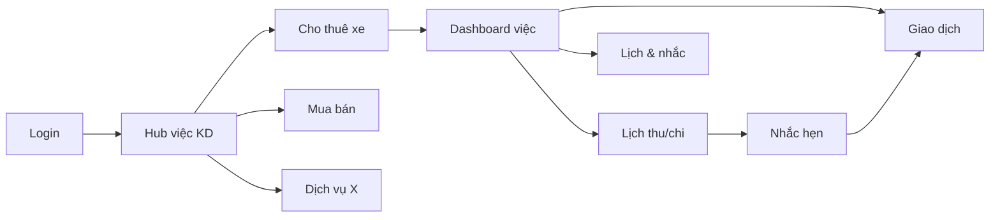
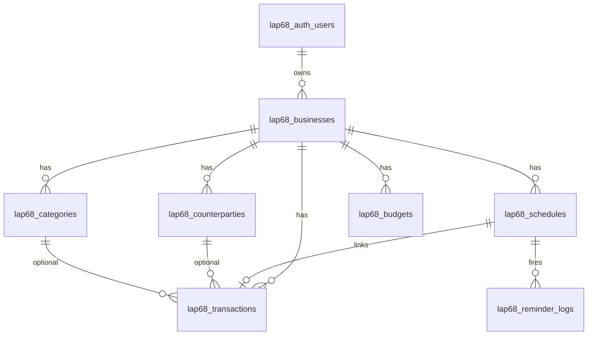

# Kế hoạch nâng cấp LAP68 — Quản lý đa dòng tiền & nhắc hẹn thu chi

> **Phiên bản tài liệu:** 1.0  
> **Ngày:** 09/07/2026  
> **Mục đích:** Đề xuất giải pháp hoàn thiện LAP68 cho cá nhân kinh doanh nhiều lĩnh vực, nhiều dòng tiền, có nhắc hẹn thu/chi theo lịch từng việc.  
> **Supabase:** Dùng chung project **3lmoto** (`fpiupgmknsydqrihqdbo`) với 79moto / 3lmotohue — **bắt buộc prefix `lap68_*`**.

---

## 1. Tóm tắt điều hành

LAP68 hiện là **sổ quỹ đơn luồng**: một user, một danh sách giao dịch thu/chi, danh mục, biểu đồ tổng. Nhu cầu thực tế là **nhiều việc kinh doanh song song** (cho thuê xe, mua bán, dịch vụ, đầu tư nhỏ…), mỗi việc có:

- Dòng tiền riêng (thu, chi, lợi nhuận)
- Lịch **phải thu** / **phải chi** (tiền thuê, trả NCC, đóng phí, thu nợ…)
- **Nhắc hẹn** trước hạn (3 ngày, 1 ngày, đúng ngày)
- Báo cáo theo việc và tổng hợp toàn portfolio

Giải pháp đề xuất: nâng cấp theo **4 phase**, giữ stack hiện tại (Next.js 16 + Supabase + dark UI), mở rộng schema `lap68_*`, UI theo mô hình **hub chọn việc** (tương tự `/dashboard/selection` của 79moto).

---

## 2. Hiện trạng

### 2.1 Ứng dụng LAP68 (v1)

| Thành phần | Trạng thái |
|------------|------------|
| Đăng nhập (`lap68_auth_users`) | Có — plaintext demo |
| Giao dịch thu/chi | Có — chưa gắn việc KD |
| Danh mục | Có — global theo user |
| Dashboard + biểu đồ | Có — tổng hợp toàn bộ |
| Báo cáo, lịch sử, sao lưu JSON | Có — cơ bản |
| Đa việc kinh doanh | **Chưa có** |
| Nhắc hẹn thu/chi | **Chưa có** |
| Đối tác theo việc | **Chưa có** |
| Realtime | **Chưa có** |

### 2.2 Supabase dùng chung (project 3lmoto)

**URL:** `https://fpiupgmknsydqrihqdbo.supabase.co`

| Nhóm bảng | App | Prefix | Ghi chú |
|-----------|-----|--------|---------|
| `customers`, `vehicles`, `rentals`, `transactions` | 79moto / 3lmotohue | Không prefix | **KHÔNG dùng cho LAP68** |
| `auth_users`, `access_logs` | 79moto | Không prefix | Khác schema LAP68 |
| `pawn_*`, `sales_*`, `loan_*` | 79moto | Module prefix | Mẫu cách tách app |
| `lap68_*` | LAP68 | `lap68_` | **Đúng hướng — tiếp tục mở rộng** |

**Bảng LAP68 đã có trên production:**

- `lap68_auth_users`
- `lap68_categories`
- `lap68_transactions`
- `lap68_access_logs`

**Script SQL v2 (chưa chạy):** [`migrations/lap68_v2_multi_business.sql`](../migrations/lap68_v2_multi_business.sql)

### 2.3 Tham chiếu codebase anh em

| Dự án | Đường dẫn | Học được gì |
|-------|-----------|-------------|
| 79moto | `~/Desktop/Code/79moto` | Hub module, `module-shell`, multi-tab dashboard, `sales_*` isolation |
| 3lmotohue | `~/Desktop/Code/3lmotohue` | Rental dashboard, backup cron, format tiền/ngày VN |
| LAP68 | `~/Desktop/Code/lap68` | Dark UI, `lap68_*` schema, cashflow charts |

> **Lưu ý:** Thư mục `Code\3lmoto` trên máy thực tế là **`3lmotohue`** — cùng Supabase project.

---

## 3. Tầm nhìn sản phẩm (v2)

### 3.1 Persona

**Chủ kinh doanh cá nhân** — vận hành 2–8 mảng việc, cần nhìn nhanh: hôm nay phải thu/chi gì, việc nào lãi/lỗ, dòng tiền tháng này từng mảng.

### 3.2 Luồng người dùng chính



### 3.3 Phạm vi tính năng mục tiêu

| # | Tính năng | Mô tả |
|---|-----------|-------|
| F1 | **Việc kinh doanh** | CRUD mảng việc: tên, màu, icon, trạng thái, thứ tự |
| F2 | **Giao dịch theo việc** | Mọi thu/chi gắn `business_id`; lọc theo việc |
| F3 | **Lịch thu/chi** | Khoản phải thu (`collect`) / phải chi (`pay`), một lần hoặc lặp |
| F4 | **Nhắc hẹn** | Nhắc trước N ngày; panel "Hôm nay / Sắp đến hạn / Quá hạn" |
| F5 | **Đối tác** | Khách/NCC theo từng việc |
| F6 | **Hub tổng** | Card từng việc: thu, chi, lợi nhuận, số việc quá hạn |
| F7 | **Báo cáo đa việc** | So sánh mảng, biểu đồ stacked theo việc |
| F8 | **Ngân sách tháng** | Kế hoạch vs thực tế (phase 2) |
| F9 | **Sao lưu nâng cao** | Export/import gồm businesses + schedules |
| F10 | **Thông báo** | In-app trước; Telegram/email sau (phase 3) |

---

## 4. Mô hình dữ liệu

### 4.1 Sơ đồ quan hệ (v2)



### 4.2 Bảng mới & thay đổi

| Bảng | Vai trò |
|------|---------|
| `lap68_businesses` | **Mảng việc / lĩnh vực** — trục chính multi-cashflow |
| `lap68_counterparties` | Khách thu, NCC chi |
| `lap68_schedules` | Lịch thu/chi + lặp + trạng thái |
| `lap68_reminder_logs` | Đã nhắc chưa (tránh spam) |
| `lap68_budgets` | Kế hoạch thu/chi tháng (phase 2) |
| `lap68_backups` | Metadata file backup Storage |
| `lap68_categories` | + `business_id` (nullable = dùng chung) |
| `lap68_transactions` | + `business_id`, `counterparty_id`, `schedule_id` |
| `lap68_business_summary` | VIEW tổng hợp nhanh |

### 4.3 Quy ước field không có cột DB

Theo chuẩn dự án: field phụ không có cột riêng → gói **`ghi_chu` JSONB**, strip trước khi gửi Supabase nếu cần.

Ví dụ `ghi_chu` trên `lap68_schedules`:

```json
{
  "bank_account": "VCB ***1234",
  "contract_ref": "HD-2026-001",
  "attachments": []
}
```

### 4.4 `recurrence` JSON (lịch lặp)

```json
{
  "frequency": "monthly",
  "interval": 1,
  "day_of_month": 5,
  "end_date": "31/12/2026"
}
```

| `frequency` | Ý nghĩa |
|-------------|---------|
| `daily` | Mỗi N ngày |
| `weekly` | Thứ trong tuần (`day_of_week`: 0–6) |
| `monthly` | Ngày cố định trong tháng |
| `yearly` | Ngày + tháng cố định |

### 4.5 SQL — Chạy trên Supabase SQL Editor

**File đầy đủ:** [`migrations/lap68_v2_multi_business.sql`](../migrations/lap68_v2_multi_business.sql)

**Các bước:**

1. Mở [Supabase Dashboard](https://supabase.com/dashboard) → project **3lmoto**
2. **SQL Editor** → New query
3. Dán toàn bộ nội dung file migration
4. **Run** → kiểm tra không lỗi
5. **Table Editor** → xác nhận bảng `lap68_businesses`, `lap68_schedules`, …

**Không chạy** script tạo `transactions`, `customers` của 79moto — tránh xung đột.

---

## 5. Kiến trúc ứng dụng (đề xuất)

### 5.1 Routing mới

```
/login
/dashboard                    → Hub việc kinh doanh (mới)
/dashboard/b/[businessId]     → Tổng quan 1 việc
/dashboard/b/[businessId]/transactions
/dashboard/b/[businessId]/schedules    → Lịch thu/chi
/dashboard/b/[businessId]/categories
/dashboard/b/[businessId]/counterparties
/dashboard/calendar           → Lịch tổng hợp mọi việc
/dashboard/reminders          → Hôm nay / sắp đến hạn / quá hạn
/dashboard/reports            → Báo cáo đa việc
/dashboard/settings
```

Giữ tương thích ngắn hạn: `/dashboard` cũ redirect → hub hoặc việc mặc định.

### 5.2 Layer dữ liệu (`lib/`)

| File mới | Trách nhiệm |
|----------|-------------|
| `lib/supabase-businesses.ts` | CRUD `lap68_businesses` |
| `lib/supabase-schedules.ts` | CRUD lịch, tính `next_due_date`, mark done → tạo transaction |
| `lib/supabase-counterparties.ts` | CRUD đối tác |
| `lib/schedule-engine.ts` | Logic lặp, overdue, reminder dates (thuần TS, test được) |
| `lib/reminder-service.ts` | Quét lịch, ghi `lap68_reminder_logs`, push in-app |
| `lib/dataTransform.ts` | `sanitizeItem` / `deserializeItem` — strip field lạ, gói `ghi_chu` |

Cập nhật `lib/supabase.ts`: thêm filter `business_id` vào fetch transactions/categories.

### 5.3 Realtime (phase 2)

Subscribe `postgres_changes` trên:

- `lap68_transactions`
- `lap68_schedules`

Pattern giống `79moto/app/dashboard/page.tsx`.

### 5.4 Cron nhắc hẹn (phase 3)

| Cách | Mô tả |
|------|-------|
| **A — Vercel Cron** | `app/api/cron/reminders/route.ts` chạy 07:00 hàng ngày |
| **B — Client** | Khi mở app, quét lịch hôm nay (đủ cho MVP) |
| **C — Telegram** | Học `3lmotohue/app/api/telegram/route.ts` |

**MVP khuyến nghị:** B + panel in-app; thêm A khi ổn định.

---

## 6. Nâng cấp giao diện (dark mode — đen / đỏ / xanh / xám)

**Design Read:** Dashboard tài chính đa việc, dark cockpit, semantic màu — xanh thu, đỏ chi, xám trung tính, đen nền.

### 6.1 Cấu trúc UI

| Màn hình | Thiết kế |
|----------|----------|
| **Hub việc** | Grid card (kiểu 79moto selection): mỗi việc 1 card — tên, màu accent, KPI mini, badge số khoản quá hạn |
| **Sidebar** | Giữ 72px; thêm nút "Tất cả việc" + context việc đang chọn (màu viền theo `business.color`) |
| **Header việc** | `ModuleBrandHeader` + suffix tên việc thay vì chỉ "LAP68" |
| **Panel nhắc** | Sticky top hoặc tab "Nhắc" — đỏ quá hạn, vàng 1–3 ngày, xanh đã xong |
| **Lịch thu/chi** | Bảng + toggle Thu/Chi; nút "Đã thu/chi" → mở form giao dịch prefill |
| **Calendar** | Month view, chấm màu theo việc; click → chi tiết khoản |

### 6.2 Component cần thêm

- `BusinessHubCard` — card việc trên hub
- `BusinessSwitcher` — dropdown đổi việc nhanh
- `ScheduleFormDialog` — tạo lịch một lần / lặp
- `ReminderPanel` — danh sách nhắc
- `OverdueAlertStrip` — thanh cảnh báo đỏ phía trên dashboard
- `BusinessComparisonChart` — stacked bar thu/chi theo việc

### 6.3 Token màu (giữ palette hiện tại, mở rộng semantic)

| Token | Màu | Dùng cho |
|-------|-----|----------|
| `--background` | `#09090b` | Nền app |
| `--card` | `#111113` | Card, bảng |
| `--income` / xanh | `#22c55e` | Thu, collect |
| `--expense` / đỏ | `#ef4444` | Chi, pay, overdue |
| `--muted` | `#71717a` | Label, phụ |
| `business.color` | Tùy việc | Viền card, chart series |

---

## 7. Lộ trình triển khai chi tiết

### Phase 1 — Nền đa việc (2–3 tuần) — **Ưu tiên cao**

| Tuần | Công việc | Deliverable |
|------|----------|-------------|
| 1 | Chạy SQL v2; cập nhật types + CRUD businesses | Migration OK trên Supabase |
| 1 | Trang Hub `/dashboard`; CRUD việc KD | Chọn / tạo / sửa việc |
| 2 | Gắn `business_id` vào transactions, categories | Lọc giao dịch theo việc |
| 2 | Dashboard theo `businessId`; BusinessSwitcher | KPI + chart theo 1 việc |
| 3 | Báo cáo tổng so sánh nhiều việc | Chart stacked |
| 3 | Migrate dữ liệu cũ → việc mặc định | Không mất data |

**Tiêu chí hoàn thành Phase 1:**

- [ ] Tạo ≥ 3 việc KD, mỗi việc có giao dịch riêng
- [ ] Hub hiển thị KPI từng việc
- [ ] Báo cáo lọc theo việc / tất cả

### Phase 2 — Lịch thu/chi & nhắc in-app (2–3 tuần)

| Tuần | Công việc | Deliverable |
|------|----------|-------------|
| 1 | CRUD `lap68_schedules`; form lặp cơ bản | Tạo khoản phải thu/chi |
| 2 | `schedule-engine.ts`; trạng thái overdue | Tự cập nhật quá hạn |
| 2 | Trang `/dashboard/reminders` + panel dashboard | Nhắc 3/1/0 ngày |
| 3 | "Đã thu/chi" → tạo `lap68_transactions` + link `schedule_id` | Đóng vòng lịch → sổ quỹ |
| 3 | `lap68_budgets` UI đơn giản | Kế hoạch vs thực tế tháng |

**Tiêu chí hoàn thành Phase 2:**

- [ ] Lịch lặp hàng tháng hoạt động (VD: tiền thuê ngày 5)
- [ ] Panel nhắc hiển thị đúng hôm nay / sắp tới / quá hạn
- [ ] Mark done tạo giao dịch tương ứng

### Phase 3 — Hoàn thiện & vận hành (2–4 tuần)

| Hạng mục | Nội dung |
|----------|----------|
| Đối tác | CRUD `lap68_counterparties`, gắn lịch & giao dịch |
| Calendar view | Lịch tháng tổng hợp |
| Realtime | Supabase subscription |
| Backup v2 | Export/import đủ bảng mới; bucket `lap68-backups` |
| Cron Vercel | `/api/cron/reminders` 07:00 |
| Telegram (tùy chọn) | Gửi nhắc quá hạn |
| Bảo mật | Bật RLS `lap68_*`; hash mật khẩu hoặc Supabase Auth |
| Mobile PWA | Add to home screen, notification permission |

### Phase 4 — Tích hợp mở rộng (tùy chọn)

- Import giao dịch từ `transactions` (79moto rental) **chỉ đọc**, gắn việc "Cho thuê xe" — không ghi đè bảng rental
- API đồng bộ một chiều nếu cần dashboard tài chính tổng hợp cả 79moto + LAP68

---

## 8. Checklist kỹ thuật Supabase

### 8.1 Trước khi chạy migration

- [ ] Xác nhận đúng project: **3lmoto** (`fpiupgmknsydqrihqdbo`)
- [ ] Backup: export JSON từ Settings hoặc `pg_dump` bảng `lap68_*`
- [ ] Không rename/xóa bảng 79moto

### 8.2 Sau khi chạy migration

- [ ] `SELECT * FROM lap68_businesses LIMIT 5;`
- [ ] `SELECT * FROM lap68_business_summary;`
- [ ] Giao dịch cũ có `business_id` (script migration tự gán việc đầu)
- [ ] Cập nhật `.env.local` / Vercel env (giữ nguyên URL + anon key)

### 8.3 Storage (phase 3)

Tạo bucket **`lap68-backups`** (private), policy chỉ service role — tương tự bucket `backups` của 79moto.

### 8.4 RLS (khuyến nghị trước production)

```sql
-- Ví dụ policy (cần chuyển sang Supabase Auth JWT thật)
ALTER TABLE lap68_businesses ENABLE ROW LEVEL SECURITY;
-- CREATE POLICY ... ON lap68_businesses FOR ALL USING (user_id = auth.uid());
```

Hiện app dùng `lap68_auth_users` custom — RLS nên gắn sau khi migrate auth.

---

## 9. Rủi ro & quyết định cần xem xét

| # | Rủi ro | Giảm thiểu |
|---|--------|------------|
| R1 | Nhầm bảng `transactions` (rental) vs `lap68_transactions` | Luôn prefix `lap68_`; code review |
| R2 | Plaintext password | Phase 3: bcrypt hoặc Supabase Auth |
| R3 | Không có RLS | Chỉ dùng cá nhân; bật RLS trước khi mở rộng user |
| R4 | Nhắc hẹn chỉ khi mở app | Thêm Vercel Cron + Telegram |
| R5 | Ngày DD/MM/YYYY vs timezone | Giữ chuẩn 79moto; engine tính theo `Asia/Ho_Chi_Minh` |
| R6 | Quá nhiều việc → UI rối | Hub + switcher; archive việc cũ |

### Quyết định cần bạn chốt

1. **Tên hiển thị việc mẫu** — Cho thuê xe / Mua bán / Dịch vụ có khớp thực tế không?
2. **Nhắc qua kênh nào trước** — Chỉ in-app hay thêm Telegram?
3. **Có cần đọc dữ liệu thuê xe từ 79moto** vào LAP68 không (phase 4)?
4. **Multi-user** — Chỉ 1 admin hay thêm staff theo việc?

---

## 10. Ước lượng effort

| Phase | Effort (1 dev) | Giá trị |
|-------|----------------|---------|
| Phase 1 | 2–3 tuần | Cao — đúng nhu cầu đa dòng tiền |
| Phase 2 | 2–3 tuần | Cao — nhắc hẹn là điểm khác biệt |
| Phase 3 | 2–4 tuần | Trung bình — vận hành ổn định |
| Phase 4 | Tùy chọn | Thấp–trung — tích hợp 79moto |

---

## 11. Bước tiếp theo đề xuất

1. **Bạn review** tài liệu này + chốt 4 quyết định mục 9.
2. **Chạy** [`migrations/lap68_v2_multi_business.sql`](../migrations/lap68_v2_multi_business.sql) trên Supabase SQL Editor.
3. **Bắt đầu Phase 1** — Hub việc kinh doanh + filter giao dịch theo `business_id`.
4. Sau Phase 1 ổn → Phase 2 lịch & nhắc.

---

## Phụ lục A — Map file code cần tạo/sửa (Phase 1)

```
app/dashboard/page.tsx              → Hub việc (thay overview đơn)
app/dashboard/b/[id]/page.tsx       → Dashboard 1 việc
app/dashboard/b/[id]/transactions/...
components/dashboard/business-hub-card.tsx
components/dashboard/business-switcher.tsx
lib/supabase-businesses.ts
lib/dataTransform.ts
migrations/lap68_v2_multi_business.sql  ✅ đã có
```

## Phụ lục B — Env vars (không đổi)

```env
NEXT_PUBLIC_SUPABASE_URL=https://fpiupgmknsydqrihqdbo.supabase.co
NEXT_PUBLIC_SUPABASE_ANON_KEY=<anon key project 3lmoto>
```

---

*Tài liệu này là cơ sở để review trước khi code Phase 1. Sau khi chốt, có thể tách thành GitHub Issues theo từng mục checklist.*
